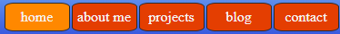
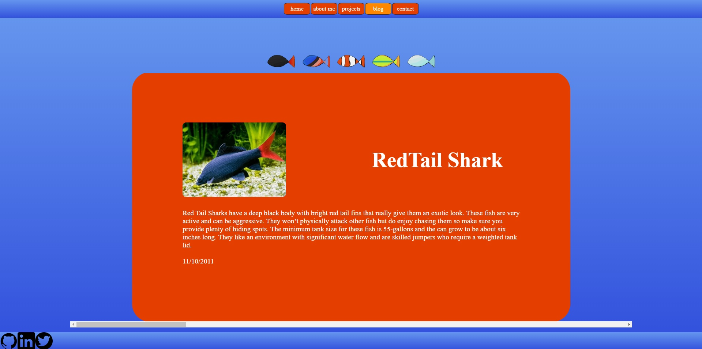
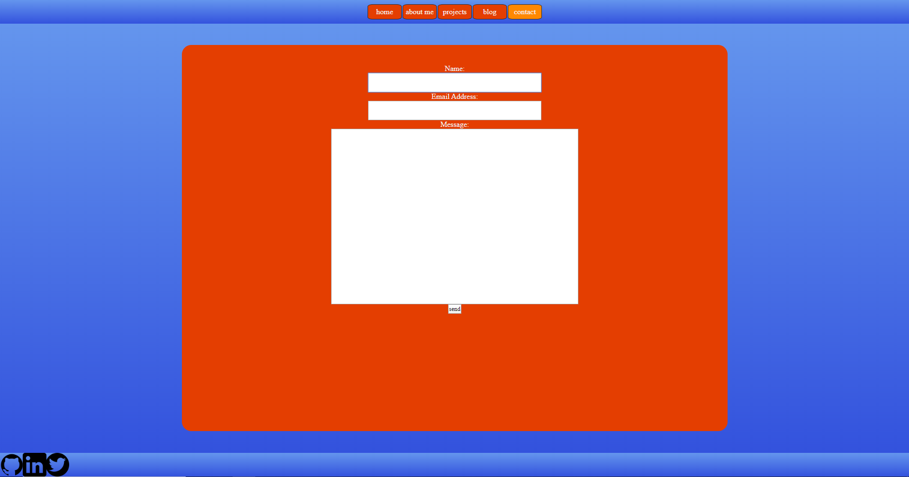
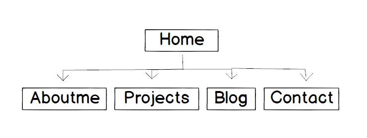
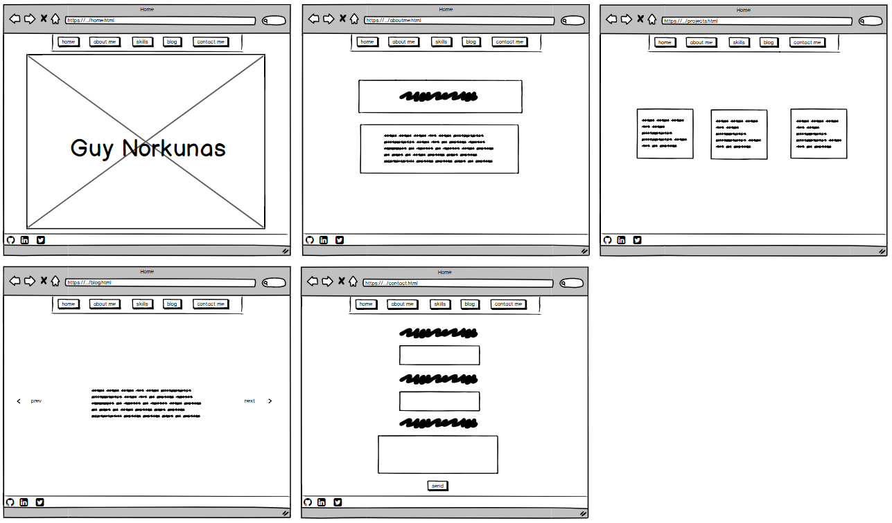
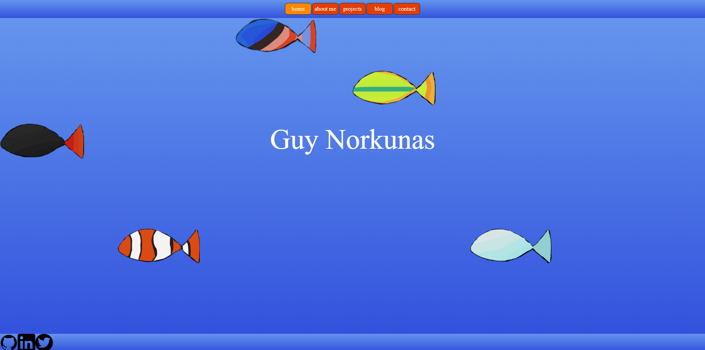
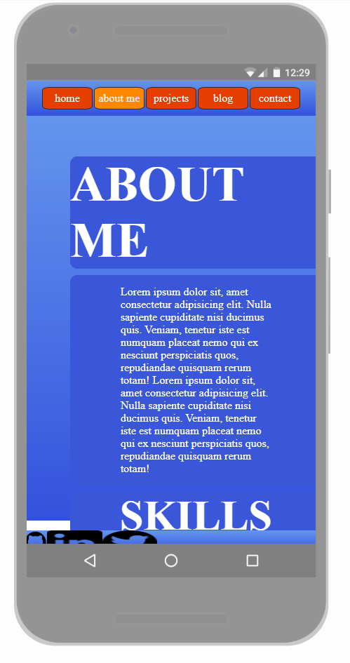
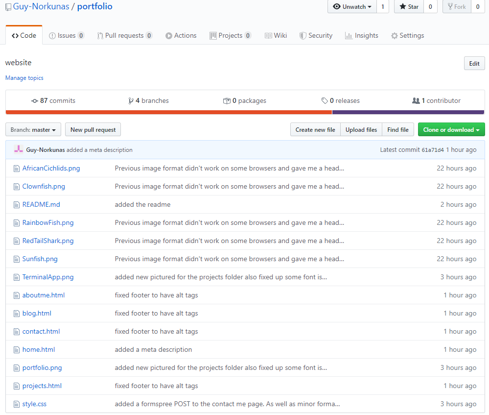

# Guy Norkunas Portfolio Website - T1A3

Website: https://guynorkunas.netlify.com/

Github: https://github.com/Guy-Norkunas/portfolio

# Purpose

The purpose of this portfolio is to demonstrate my skills in HTML/CSS and showcase to employers the skills that I have to offer and maybe gain opportunities for employment or collaboration from that. The website also serves the purpose of being a project I can constantly work on and improve as my programming skills improve, giving me a platform to display my progress and improvement over time to myself and those who may be interested.

# Funcionality and features

## Nav bar / footer

The website features a fully functioning and responsive navbar and footer that allows the user of the website to easily and quickly go between the different pages available.

The nav bar sits at the top of the website and links to other pages. It also contains an animation that quickly changes colour to give the user feedback that they are hovering over a certain anchor tag. It also highlights the current pages link on the nav bar so the user easily knows what page they are on.

While the footer links to various social media and coding relevant platforms. It links to my github profile, my linkedin profile and my twitter profile.

## Slider blogs

The blogs that are hosted on the website are presented in a way that displays only one blog at a time. The user can view other blogs by either clicking on one of the fish (indicating the fish that the blog is about) or by scrolling through blogs. If the user chooses to scroll they will never get stuckm in between two blogs because the scroll wheel snaps to the start of a blog so that it gives a much cleaner look.

## Contact form

The site also allows for the user to contact me through the contact page. The contact page is linked to a formspree POST request that then sends the message typed in to me via email. This feature will allow me to receive enquries from potential employers as well as anyone who may be interested in collaborating.

# Sitemap & wireframe

## Sitemap

## Wireframe

# screenshots

## The landing page of the website

## The mobile view, clearly doesn't respond well to mobile devices

# Target audience

The target audience of this website, at least one day, will be potential employers and collaborators who are looking to see an example of my work. The target audience may also be people who like very minamilistic fish and the colour blue. 

# Tech stack

## HTML

Used extensively to set up the foundation of all the website pages as well as setting up the SRI security to help protect against exploits.

## CSS

Used to style the HTML as well as adding some animations to the webpage to make it more presentable and attractive to the users.

## Git

Git and github were used as source control for the project. Many branches were implemented during development to ensure that none of the changes made conflicted to much and that if they did it was easy to see where the conflict was and to make a resolution. Also at the end of the project I utilised additional branches to showcase the website with slight differences in appearance. 

# Thanks :)